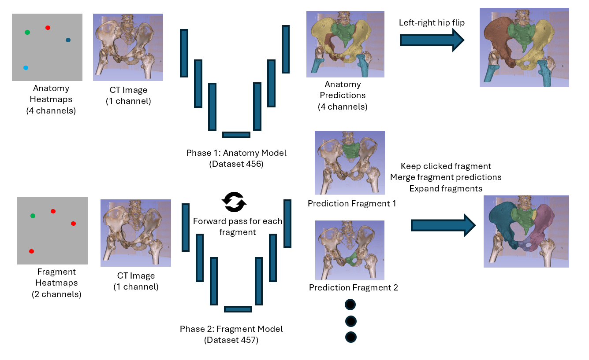

# PENGWIN 2026 — Task 2 Baseline

A reference baseline for **Task 2** of the
[PENGWIN 2026 Challenge](https://pengwin2026.grand-challenge.org/):
interactive segmentation of pelvic bone fragments in CT.

Training data is the official release on Zenodo:
**[zenodo.org/records/19732767](https://zenodo.org/records/19732767)**.

The baseline trains two complementary [nnUNetv2](https://github.com/MIC-DKFZ/nnUNet)
models that can be combined to produce per-fragment instance segmentation.


---

## Approach

The raw label volume uses an integer encoding that packs both anatomy and instance:

| Range | Anatomical class | Meaning |
|-------|------------------|---------|
| 0          | —          | background |
| 1 – 50     | sacrum     | up to 50 sacrum fragments |
| 51 – 100   | left hip   | up to 50 left hipbone fragments |
| 101 – 150  | right hip  | up to 50 right hipbone fragments |
| 151 – 200  | femur      | up to 50 femur fragments |

We factor the problem into two segmentation stages plus a deterministic
post-processing step:

1. **Anatomical 5-class segmentation** (`Dataset456_PENGWIN`)
   `0=bg, 1=sacrum, 2=leftHip, 3=rightHip, 4=femur`
   A single nnUNetv2 model maps the whole CT volume to anatomy. The difference to Task 1 is that we also have Gaussian heatmaps as additional 4 channels to the 4 anatomies.

2. **Fragment 2-class segmentation** (`Dataset457_PENGWIN_frag`)
   `0=bg, 1=foreground, 2=background`
   For each fragment we set its click to a foreground heatmaps and all of the other clicks to background and predict with our second baseline. We repeat this process for all fragments, resulting in `n` forward passes for `n` fragments.

3. **Fragment post-processing** 
  After obtaining initial fragment predictions from nnUNet, we apply a multi-step post-processing pipeline to refine and consolidate the results. First, we filter the fragment predictions using click-guided heatmaps to keep only the connected component that overlaps with the user's click, effectively removing spurious fragments. For anatomies that contain only a single fragment, we directly copy those predictions without running the fragment model. Next, we merge all fragment predictions (from sacrum, left hip, right hip, and femur) into a single unified volume with labels ranging from 1-200. Finally, we perform a hole-filling step where any background voxels within the anatomical regions are filled with the most frequently occurring fragment label from that anatomy, ensuring complete coverage without overwriting existing fragment labels. This ensures that every voxel within the predicted anatomical boundaries receives a fragment label, producing dense, coherent segmentation results.


Following steps 1,2, and 3 leads to the the official label ranges (sacrum 1–50, leftHip 51–100, rightHip 101–150,
femur 151–200).




---

## Repository layout

```
AutoSeg-Baseline/
├── install.sh
├── LICENSE
├── README.md
|
├── inference
│   ├── convert_anatomy_to_nnunet_input.py
│   ├── convert_fragments_to_nnunet_input.py
│   ├── copy_single_fragment_anatomies.py
│   ├── expand_fragments_to_anatomy.py
│   ├── filter_left_right.py
│   ├── keep_clicked_fragment.py
│   ├── merge_all_fragment_predictions.py
│   └── README.md
|
├── preprocessing
│   ├── anatomy
│   │   ├── add_pengwin_heatmaps_anatomy.py
│   │   ├── convert_to_nnunet_format.py
│   │   ├── README.md
│   │   └── remap_pengwin_labels.py
│   └── fragments
│       ├── create_fragment_nnUNet_dataset.py
│       └── README.md
|
└── simualtion
|   ├── simulate_clicks_pengwin.py
|   ├── README.md
|   
└── training
    ├── anatomy
    │   ├── dataset.json
    │   └── train_anatomical.md
    └── fragments
        ├── dataset.json
        └── train_fragments.md


```

---

## Data and model setup
Please take a look at these descriptions to get started:
- [`preprocessing/anatomy/README.md`](preprocessing/anatomy/README.md)
- [`preprocessing/fragments/README.md`](preprocessing/fragments/README.md)
- [`training/train_anatomy/train_anatomical.md`](training/anatomy/train_anatomical.md)
- [`training/fragments/train_fragments.md`](training/fragments/train_fragments.md)
- [`inference/README.md`](inference/README.md)

---

## Data

The Zenodo archive contains the training set in `.mha` format:

```
├── PENGWIN26_task1_2_train_part1/
│   ├── 001/
│   │   ├── image.mha
│   │   └── label.mha
│   ├── 002/
│   │   ├── image.mha
│   │   └── label.mha
│   └── ...
├── PENGWIN26_task1_2_train_part2/
├── PENGWIN26_task1_2_train_part3/
├── PENGWIN26_task1_2_train_part4/
└── PENGWIN26_task2_train_clicks/
    ├── center_of_mass/
    │   ├── 001/
    │   │   ├── peripelvic-fragment-clicks.json
    │   ├── 002/
    │   │   ├── peripelvic-fragment-clicks.json
    │   └── ...
    ├── boundary_internal_margin/
    ├── uniformly_sampled/
    ├── euclidean_distance_transform/
    └── ...
```

`image.mha` is a CT volume; `label.mha` is an integer volume using the
anatomy + instance encoding described in the table above. The `peripelvic-fragment-clicks.json` are pre-simulated clicks from [`simulation/simulate_clicks_pengwin.py`](simulation/simulate_clicks_pengwin.py).


---

## Hardware

- nnUNetv2 `3d_fullres` typically needs a GPU with **≥ 12 GB** of memory.
  For smaller GPUs, swap in `3d_lowres` or `2d` as documented in the training recipes.
- `simulate_clicks_pengwin.py` will use GPU if available (CUDA) and otherwise fall back to CPU.

---

## Citation

If you use this baseline, please cite the PENGWIN 2026 challenge and the Zenodo
training set linked above, in addition to nnU-Net:

> Isensee, F., Jaeger, P.F., Kohl, S.A.A. *et al.* nnU-Net: a self-configuring
> method for deep learning-based biomedical image segmentation.
> *Nat Methods* **18**, 203–211 (2021).
